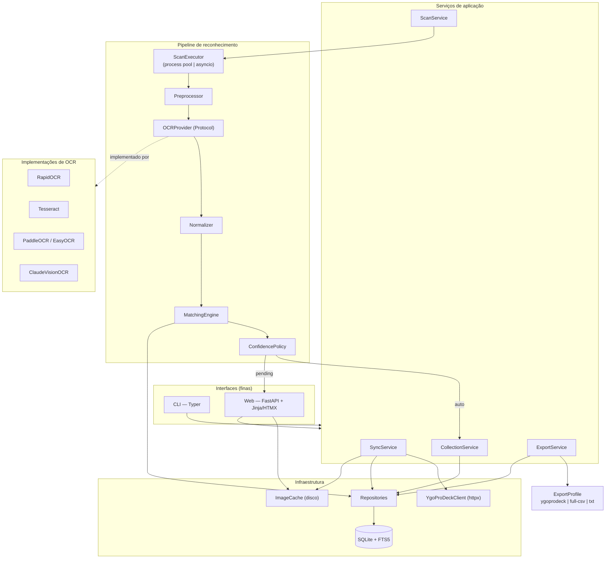
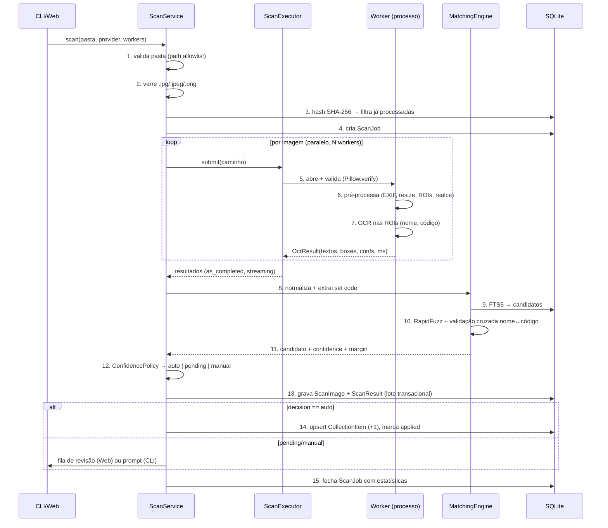

# Yu-Gi-Oh! Collection Scanner — Plano Técnico

> Documento de arquitetura. Nenhum código foi escrito ainda.
> Status: **aguardando aprovação**. Após aprovação, implementação fase a fase (§16).

---

## 0. Pesquisa realizada (fatos verificados, não suposições)

Antes de decidir qualquer coisa, consultei as fontes reais. Resumo do que foi **confirmado** e do que **não pôde ser confirmado**:

### 0.1 YGOPRODeck API v7 — confirmado

Base: `https://db.ygoprodeck.com/api/v7/`

| Endpoint | Uso no projeto |
|---|---|
| `cardinfo.php` | Carga completa do catálogo (sem parâmetros = todas as cartas) |
| `cardsets.php` | Catálogo de sets (nome, prefixo, nº de cartas, data, imagem) |
| `cardsetsinfo.php?setcode=SDY-046` | Consulta pontual de um print específico |
| `checkDBVer.php` | `database_version` + `date` → decide se precisa re-sincronizar |
| `archetypes.php` | Lista de arquétipos (opcional, para filtros) |

- **Rate limit: 20 requisições por segundo.** Respostas cacheadas 2 dias no lado deles.
- Campos ausentes **não aparecem** no JSON (*"If a piece of response info is empty or null then it will NOT show up"*) → todo campo é opcional no parser.
- Resposta real de carta (verificada com Blue-Eyes White Dragon):

```json
{
  "id": 89631139, "name": "Blue-Eyes White Dragon",
  "typeline": ["Dragon","Normal"], "type": "Normal Monster",
  "humanReadableCardType": "Normal Monster", "frameType": "normal",
  "desc": "...", "race": "Dragon", "atk": 3000, "def": 2500,
  "level": 8, "attribute": "LIGHT", "archetype": "Blue-Eyes",
  "ygoprodeck_url": "...",
  "card_sets": [
    {"set_name":"2016 Mega-Tins","set_code":"CT13-EN008",
     "set_rarity":"Ultra Rare","set_rarity_code":"(UR)","set_price":"74.49"}
  ],
  "card_images": [
    {"id":89631139,"image_url":"...","image_url_small":"...","image_url_cropped":"..."},
    {"id":89631140,"image_url":"...","image_url_small":"...","image_url_cropped":"..."}
  ],
  "card_prices": [{"cardmarket_price":"0.07","tcgplayer_price":"0.13"}],
  "misc_info": [{"tcg_date":"2002-03-08","ocg_date":"1999-03-06",
                 "konami_id":4007,"has_effect":0,"md_rarity":"Ultra Rare"}]
}
```

- `cardsets.php` (verificado): `set_name`, `set_code`, `num_of_cards`, `tcg_date`, `set_image` (opcional).

### 0.2 Política de imagens — confirmado e **decisivo**

Citação literal do guia:

> "Do not continually hotlink images directly from this site. Please download and re-host the images yourself."
> "Please only pull an image once and then store it locally. If we find you are pulling a very high volume of images per second then your IP will be blacklisted and blocked."

**Consequência arquitetural:** a UI Web **não pode** apontar `` para `images.ygoprodeck.com`. Toda imagem é baixada uma única vez, gravada em cache local e servida pelo nosso próprio endpoint. Isso elimina a opção "usar URL direto" da §16 do briefing.

### 0.3 Limitações e ambiguidades da API — importantes para o modelo de dados

1. **`set_code` tem dois significados diferentes.** Em `cardsets.php` é o *prefixo do set* (`"YS15"`, `"CT10"`). Em `card_sets[]` de uma carta é o *código completo do print* (`"CT13-EN008"`). Ligar um ao outro exige extrair o prefixo do código do print — heurístico, e nem sempre casa 1:1.
2. **Não existe ID estável de print.** `card_sets[]` não traz chave primária. Precisamos sintetizar: `(card_id, set_code_completo, rarity)`.
3. **A mesma carta pode aparecer duas vezes no mesmo set** com raridades diferentes → a chave precisa incluir a raridade.
4. **Arte alternativa não é mapeável ao set.** `card_images[]` traz vários IDs (89631139, 89631140) mas nada diz qual print usa qual arte. Não conseguimos deduzir a arte a partir do set code. *(Limitação conhecida; resolvível no futuro só com visão computacional.)*
5. **Não há idioma/região por print** além do que está embutido no código. Códigos antigos não têm região (`SDK-001`), modernos têm (`MAGO-EN001`, `RA01-EN001`).
6. **Preço:** `set_price` é snapshot por print; `card_prices` é por carta, não por print. Tratar como informativo e datado, nunca como fonte de verdade.
7. **Paginação confirmada** (verificada em 2026-09-09): `cardinfo.php?num=N&offset=M` devolve `{data, meta}`, com `meta` trazendo `total_rows`, `pages_remaining` e `next_page_offset`. É o caminho usado, e não a carga única, porque mantém a memória constante e dá progresso real.
8. **`checkDBVer.php` devolve `last_update`, não `date`** como o guia diz. O parser aceita os dois.

### 0.3.1 Confirmações obtidas na implementação (catálogo real: 14.524 cartas / 44.517 prints / 646 sets)

* O duplo sentido de `set_code` **se manifesta na prática**: o set "2-Player Starter Set" é `STAX` em `cardsets.php`, mas seus prints usam `STAS-EN008`. Por isso `card_print.set_prefix` é FK anulável — 81 prints (0,18%) ficam sem set ligado e são preservados com o nome textual.
* 3 códigos em 44.517 são genuinamente não-parseáveis e ficam como texto: `DB5`, `DB9` (prefixos de set sem número de carta) e `MF03-EN0??` (a própria API traz `??`).
* Casos reais que o parser precisa acertar e que estão fixados em teste: `IOC-SE1` (Special Edition — **não** é região "S"), `SR03-ENTKN` (número sem dígito nenhum), `PSV-E088` (região europeia de uma letra).

### 0.4 Formato de exportação — confirmado parcialmente

- **YGOPRODeck Collection Manager (CONFIRMADO via fórum/suporte oficial):** o importador aceita CSV com as colunas
  `Card Name, Card Quantity, Card Rarity, Card Condition, Card Edition, Card Set, Card Set Code`.
  Notas conhecidas: a coluna `cardid` de exports antigos deve ser removida; a tag `Custom_` (packs customizados) **não** é aceita pelo importador.
- **YGOPocket (CONFIRMADO em 2026-09-09 — exports reais fornecidos pelo usuário):** `ygopocket.com` não tem documentação pública, mas o usuário exportou a própria coleção do app e forneceu os dois arquivos (`export-samples/`). Formato verificado byte a byte:

  **CSV** — UTF-8 com BOM, `

`, separador vírgula, 26 colunas fixas nesta ordem:
  ```
  card_id,card_name,quantity,set_code,rarity,art_variant,variant_label,condition,
  language,printing_region,notes,storage_location,grading_company,grade,
  certification_number,subgrade_centering,subgrade_corners,subgrade_edges,
  subgrade_surface,sealed,signed,altered,source,edition,purchase_price,
  market_value_override
  ```
  Exemplo real de linha: `49847524,Flame Administrator,1,SDSB-PT044,Common,,,NM,PT,pt,,,,,,,,,,false,false,false,,,,`

  Achados que importam para o mapeamento:
  - **`card_id` é o passcode do YGOPRODeck** — verificado contra o catálogo local: `49847524` = "Flame Administrator" em ambos. Isso elimina qualquer ambiguidade de identidade entre os dois sistemas.
  - `condition` usa abreviação (`NM`), não o nome por extenso. Só temos esse exemplo confirmado; o restante do vocabulário (`LP`/`MP`/`HP`/`DMG`) é assumido por ser convenção quase universal do hobby (TCGplayer, Cardmarket, etc.), **não verificado** — sinalizado no exportador.
  - `language`/`printing_region` são pares maiúsculo/minúsculo do mesmo código (`PT`/`pt`).
  - Campos sem equivalente no nosso modelo (`art_variant`, `grading_*`, `subgrade_*`, `sealed`, `signed`, `altered`, `source`, `purchase_price`, `market_value_override`) saem vazios/`false` — não inventamos dado que não temos.
  - **Achado colateral sobre a API:** o print `SDSB-PT044` (variante em português) **não existe** no nosso catálogo sincronizado — só `SDSB-EN044`. A YGOPRODeck tem parâmetro `language` documentado (`fr`,`de`,`it`,`pt`) que exige consulta **separada** por idioma; o sync padrão (Fase 2) só traz os prints que vêm na resposta default. Registrado como limitação conhecida — fora de escopo para corrigir agora.

  **TXT** — uma linha por *tipo* de carta (não por cópia), formato `<quantidade> <nome>`, sem cabeçalho. Exemplo real: `1 Flame Administrator` (22 bytes, sem newline final na amostra de uma linha só).

> **Decisão:** o exportador é construído como **plugin de perfis**. Perfis `ygoprodeck` e `ygopocket` — ambos verificados contra dado real — mais os genéricos `full-csv` / `txt`. Adicionar um perfil é uma classe nova, zero mudança arquitetural.

---

## 1. Resumo executivo

Aplicação Python local, monolito modular, com **um único núcleo de domínio** consumido por duas interfaces finas (CLI Typer e Web FastAPI+HTMX). O catálogo do YGOPRODeck é baixado uma vez para **SQLite local** (com FTS5) e a partir daí a aplicação é 100% offline exceto por sincronizações explícitas e download sob demanda de imagens.

O scanner é um **pipeline em duas metades**: a metade cara (decodificação + pré-processamento + OCR) roda em *worker pool* isolado, e a metade barata (normalização, matching, persistência) roda no processo principal com escritor único no SQLite. O OCR é acessado por trás de um `Protocol` (`OCRProvider`) com implementações intercambiáveis (RapidOCR local por padrão, Tesseract, PaddleOCR/EasyOCR, e Claude Vision como fallback de alta precisão).

O matching nunca confia no OCR: normaliza agressivamente, extrai o set code por regex **validado contra os prefixos reais do banco**, busca candidatos por FTS5 + RapidFuzz, e produz um **score de confiança com margem** que roteia cada leitura para *auto-adicionar*, *confirmar* ou *revisar manualmente*. Nada abaixo do limiar entra na coleção sem você ver.

Idempotência é garantida por **hash SHA-256 do conteúdo do arquivo**, não pelo nome — rodar `scan` duas vezes na mesma pasta é um no-op.

**Não-objetivos desta versão:** autenticação, multi-usuário, deploy remoto, reconhecimento por visão computacional. A arquitetura deixa espaço para todos (§15 e Fase 10+), mas nenhum é construído agora.

---

## 2. Arquitetura

### 2.1 Princípio organizador

Três camadas, com dependência **sempre para dentro**:

- **Interfaces** (`cli/`, `web/`) — só traduzem entrada/saída. Sem regra de negócio.
- **Serviços de aplicação** (`services/`) — casos de uso. Orquestram, transacionam, decidem.
- **Domínio + Infra** (`domain/`, `repositories/`, `ocr/`, `ygoprodeck/`) — modelos, regras puras e adaptadores.

Isto é Hexagonal aplicado **apenas onde há troca real de implementação**: OCR (4 providers), exportadores (N perfis) e fonte de catálogo. O resto é código direto — repositórios são classes concretas com SQLAlchemy dentro, sem interface abstrata, porque nunca vamos trocar o SQLite. *Interface sem segundo implementador é overengineering.*

### 2.2 Diagrama



### 2.3 Regra de ouro sobre concorrência e banco

SQLite tem **um escritor**. Portanto: workers de OCR **nunca** tocam o banco. Eles recebem um caminho de arquivo e devolvem um DTO puro (texto + boxes + tempos). Matching e escrita acontecem no processo principal, em lotes transacionais. Isso elimina de saída toda a classe de bugs `database is locked`.

---

## 3. Stack tecnológica

| Componente | Tecnologia | Motivo |
|---|---|---|
| Backend | **FastAPI** + Uvicorn | Tipagem nativa com Pydantic (o projeto inteiro já é tipado), OpenAPI grátis, e serve Jinja igualmente bem. Django traz ORM/admin/auth que não usaremos (peso morto); Flask exigiria montar validação e schemas à mão. |
| Frontend | **Jinja2 + HTMX + Alpine.js (pontual) + Pico.css** | App pessoal e local: zero build step, zero `node_modules`, zero API duplicada. HTMX cobre exatamente o que precisamos (tabela com filtro/ordenação, progresso via SSE, edição inline). React/Vue exigiriam segundo runtime, bundler e uma camada JSON só para si — custo sem retorno aqui. |
| Database | **SQLite** (WAL, `synchronous=NORMAL`) + **FTS5** | Exigência do briefing; FTS5 vem no Python oficial do Windows e resolve busca por nome em O(log n). |
| ORM | **SQLAlchemy 2.0** (declarativo tipado, `Mapped[]`) + **Alembic** | 2.0 tem tipagem estática de primeira classe — o argumento histórico a favor do SQLModel evaporou. SQLModel funde modelo de persistência e schema de API (acopla banco e HTTP) e está atrás em features. Preferimos **Pydantic separado** para schemas de API/DTOs. Alembic é obrigatório: o schema vai mudar entre fases. |
| Validação/DTO | Pydantic v2 | Parsing tolerante do JSON da API, schemas HTTP, DTOs entre processos. |
| CLI | **Typer** + Rich | Deriva a CLI dos type hints que já vamos escrever — sem duplicar assinatura em `add_argument`. É Click por baixo (maduro, testável com `CliRunner`), com subcomandos aninhados (`collection add`). `argparse` custaria centenas de linhas de boilerplate. |
| HTTP client | httpx | Sync + async na mesma API, timeouts explícitos, fácil de mockar com `respx`. |
| OCR padrão | **RapidOCR** (ONNXRuntime, modelos PP-OCR) | `pip install` puro — **sem dependência de sistema no Windows**, que é o seu ambiente. Tesseract exige instalador externo; PaddleOCR arrasta `paddlepaddle` (pesado e frágil no Windows). Precisão comparável ao PaddleOCR por ser o mesmo modelo. |
| OCR alternativos | Tesseract (`pytesseract`), PaddleOCR, EasyOCR, **ClaudeVisionOCR** | Todos por trás do mesmo `Protocol`; escolhidos por config. |
| Fuzzy matching | **RapidFuzz** | C++ por baixo, ~100× mais rápido que `difflib`; `process.cdist` com `score_cutoff` varre 14k nomes em poucos ms. |
| Imagem | Pillow (+ OpenCV opcional na Fase 3) | Pillow cobre decodificação/validação/recorte. OpenCV só entra se o pré-processamento simples não bastar — não arrastar 60 MB antes de precisar. |
| Config | **pydantic-settings** + `.env` | Um único objeto `Settings` tipado, validado no boot, precedência env > `.env` > default. |
| Logging | `structlog` sobre stdlib logging | JSON para diagnóstico, console legível via Rich no CLI. |
| Testes | pytest, pytest-cov, respx, freezegun | Ver §12. |
| Qualidade | **ruff** (lint+format) + **mypy --strict** em `domain/`, `matching/`, `exporters/` | Strict onde a lógica pura vive; modo normal no resto para não brigar com decoradores. |
| Empacotamento | `pyproject.toml` + hatchling, layout `src/` | `pip install -e .`; entrypoint `yugioh-scanner`. |

**Dependências que deliberadamente NÃO entram agora:** Celery/Redis (não há multi-máquina), Docker (Fase 11), pandas (o `csv` da stdlib basta), OpenCV (só se necessário), React/Vue.

---

## 4. Modelo de dados

### 4.1 Decisão: separar `Card` / `CardPrint` / `CollectionItem`

Sim, a separação em três é a correta, e a razão é concreta: a relação carta↔set é **muitos-para-muitos com atributos próprios** (raridade, código do print, preço) — uma tabela de junção com dados é obrigatória. Além disso, `CollectionItem` precisa referenciar **o print quando conhecido e a carta quando não**, o que exige FK opcional para print e FK obrigatório para carta. Fundir `Card` e `CardPrint` duplicaria o texto da carta ~5× (média de prints por carta) e tornaria "quantas cartas diferentes eu tenho" uma pergunta difícil.

Acrescento duas entidades que o briefing não pediu mas que a idempotência (§14) exige: `ScanImage` e `ScanResult`.

### 4.2 Diagrama ER

```mermaid
erDiagram
    CARD ||--o{ CARD_PRINT : "existe em"
    CARD ||--o{ CARD_IMAGE : "tem artes"
    CARD_SET ||--o{ CARD_PRINT : "contém"
    CARD ||--o{ COLLECTION_ITEM : "possuída como"
    CARD_PRINT ||--o{ COLLECTION_ITEM : "print (opcional)"
    SCAN_JOB ||--o{ SCAN_IMAGE : "processa"
    SCAN_IMAGE ||--o| SCAN_RESULT : "produz"
    SCAN_RESULT }o--o| COLLECTION_ITEM : "aplicado em"
    SCAN_RESULT }o--o| CARD : "identificou"

    CARD {
        int id PK "passcode YGOPRODeck"
        string name UK
        string name_normalized "indexado"
        string type
        string frame_type
        text desc
        int atk "null"
        int def "null"
        int level "null"
        string attribute "null"
        string race "null"
        string archetype "null"
        int scale "null"
        int linkval "null"
        json typeline "null"
        json linkmarkers "null"
        date tcg_date "null"
        int konami_id "null"
        bool has_effect
        datetime synced_at
    }

    CARD_IMAGE {
        int id PK "id da arte"
        int card_id FK
        string image_url
        string image_url_small
        string image_url_cropped
        bool is_primary
        string cached_path "null"
    }

    CARD_SET {
        string set_code PK "prefixo: LOB, MP24"
        string set_name
        int num_of_cards "null"
        date tcg_date "null"
        string set_image "null"
        string cached_image_path "null"
    }

    CARD_PRINT {
        int id PK "sintético"
        int card_id FK
        string set_code_full "LOB-EN001"
        string set_code_normalized "indexado"
        string set_prefix FK "null se não resolver"
        string set_name
        string rarity "null"
        string rarity_code "null"
        string region "null: EN/FR/JP"
        string number "001"
        decimal set_price "null, snapshot"
        datetime synced_at
    }

    COLLECTION_ITEM {
        int id PK
        int card_id FK
        int card_print_id FK "NULL = set indefinido"
        int quantity
        string condition "default NM"
        string edition "default Unlimited"
        string language "default EN"
        text notes "null"
        string source "scan|manual|import"
        datetime added_at
        datetime updated_at
    }

    SCAN_JOB {
        int id PK
        string folder_path
        string ocr_provider
        int workers
        string status "running|done|failed|cancelled"
        int total_images
        int processed
        int auto_added
        int pending
        int failed
        datetime started_at
        datetime finished_at "null"
    }

    SCAN_IMAGE {
        int id PK
        int job_id FK
        string file_path
        string file_hash UK "sha256 do conteúdo"
        int file_size
        string status "ok|ocr_empty|invalid|error"
        text error "null"
        json ocr_raw "texto + boxes + confianças"
        int ocr_ms
        datetime created_at
    }

    SCAN_RESULT {
        int id PK
        int scan_image_id FK
        int card_id FK "null se não identificou"
        int card_print_id FK "null"
        string ocr_name_raw
        string ocr_code_raw "null"
        float name_score
        float code_score
        float confidence
        float margin "gap para o 2o candidato"
        json candidates "top-5 para revisão"
        string decision "auto|pending|confirmed|rejected|unmatched"
        bool applied "entrou na coleção?"
        int collection_item_id FK "null"
        datetime decided_at "null"
    }
```



### 4.3 Chaves, índices e constraints

**Chaves primárias**
- `card.id` = passcode do YGOPRODeck (estável e natural — não inventar surrogate).
- `card_set.set_code` = prefixo do set (natural, vem de `cardsets.php`).
- `card_print.id` = surrogate **necessária**, porque a API não fornece ID de print (§0.3.2).

**Constraints**

```sql
-- print único por (carta, código completo, raridade) — cobre o caso da mesma
-- carta no mesmo set em raridades diferentes
CREATE UNIQUE INDEX ux_print ON card_print(card_id, set_code_full, COALESCE(rarity,''));

-- um item de coleção por combinação lógica.
-- ATENÇÃO: SQLite trata NULLs como distintos em UNIQUE, então um print NULL
-- quebraria a unicidade. Solução: índice sobre expressão.
CREATE UNIQUE INDEX ux_collection ON collection_item(
    card_id, COALESCE(card_print_id, -1), condition, edition, language
);

-- quantidade 0 => DELETE da linha, nunca linha morta
CHECK (quantity > 0)

CREATE UNIQUE INDEX ux_scan_hash ON scan_image(file_hash);  -- GLOBAL, não por job
```

**Índices de performance**

```sql
CREATE INDEX ix_card_name_norm       ON card(name_normalized);
CREATE INDEX ix_print_code_norm      ON card_print(set_code_normalized);
CREATE INDEX ix_print_card           ON card_print(card_id);
CREATE INDEX ix_print_prefix         ON card_print(set_prefix);
CREATE INDEX ix_collection_card      ON collection_item(card_id);
CREATE INDEX ix_scan_result_pending  ON scan_result(decision) WHERE decision='pending';
CREATE INDEX ix_scan_image_job       ON scan_image(job_id);

CREATE VIRTUAL TABLE card_fts USING fts5(
    name_normalized,
    content='card', content_rowid='id',
    tokenize='unicode61 remove_diacritics 2'
);
```

**Tabela de estado**

```sql
sync_state(key TEXT PRIMARY KEY, value TEXT, updated_at DATETIME)
-- guarda: database_version, last_full_sync, card_count, print_count, schema_version
```

### 4.4 Notas de projeto

- `quantity` fica em `collection_item`, não em `card`. Um item = uma combinação (carta, print, condição, edição, idioma). Permite ter 3 cópias NM de `LOB-EN001` e 1 Played sem inventar tabelas novas.
- `condition`/`edition`/`language` entram na v1 com defaults **mesmo sem UI para editá-los na Fase 5** — porque são exatamente as colunas que o CSV do YGOPRODeck exige (§0.4). Adicionar coluna depois com dados existentes é migração; entrar com default é grátis.
- `card_print.set_prefix` é FK **nullable** de propósito: quando a extração do prefixo não casar com nenhum set do catálogo, guardamos `NULL` e mantemos `set_name` textual em vez de perder o print.
- `scan_result.candidates` (JSON) guarda o top-5 com scores — é o que a tela de revisão mostra sem re-rodar o matching.

---

## 5. Fluxo do scanner

### 5.1 Passo a passo



### 5.2 Detalhe do passo 6 — pré-processamento

Cada etapa é opcional e configurável; a ordem importa:

1. **Validação estrutural** — `Image.open().verify()` seguido de reopen (verify invalida o handle). Rejeita arquivo corrompido antes de gastar CPU.
2. **Guarda de decompression bomb** — recusa `width*height > MAX_PIXELS` (default 40 MP).
3. **Correção de orientação** — aplica EXIF `Orientation`. Fotos de celular chegam rotacionadas; sem isso o OCR falha 100%.
4. **Downscale para lado maior = 1600 px** — fotos de 12 MP não melhoram o OCR e custam 5× mais tempo.
5. **Detecção de ROI (região de interesse):** o layout da carta Yu-Gi-Oh! é fixo — o **nome** fica na faixa superior (~0–12% da altura) e o **set code** no canto inferior-direito (~88–98% da altura, 55–100% da largura). Rodar OCR **só nessas duas faixas** é o maior ganho isolado de precisão e velocidade do pipeline. Fallback: se a ROI não render texto, roda na imagem inteira.
6. **Realce por ROI** — grayscale + autocontraste; para o set code (texto minúsculo) também upscale 2× + sharpen. Sem upscale a taxa de acerto do código despenca.

> Nota honesta: a ROI por proporção fixa assume que a foto está **enquadrada na carta**. Fotos com muita margem/fundo vão errar. Por isso a Fase 3 inclui **detecção de borda da carta** simples (maior contorno retangular); se ela falhar, caímos para a imagem inteira. Detecção robusta em cena complexa fica para a Fase 10.

---

## 6. Estratégia de OCR

### 6.1 Contrato (o ponto de desacoplamento)

```python
class OCRProvider(Protocol):
    name: str

    def read(self, request: OCRRequest) -> OCRResult: ...
    def warmup(self) -> None: ...  # carrega o modelo uma vez por worker
    def close(self) -> None: ...


@dataclass(frozen=True)
class OCRRequest:
    image_path: Path
    regions: dict[str, BoundingBox]  # {"name": ..., "code": ...}
    hints: dict[str, str]  # ex.: whitelist de caracteres


@dataclass(frozen=True)
class OCRResult:
    texts: dict[str, list[TextLine]]  # por região
    provider: str
    elapsed_ms: int
    raw: dict  # payload bruto para debug
```

Registro por nome (`OCR_PROVIDER=rapidocr|tesseract|paddle|easyocr|claude`), instanciado por factory. Trocar de provider é mudar **uma variável de ambiente** — nenhum outro módulo importa uma biblioteca de OCR.

### 6.2 Comparação

| Provider | Instalação no Windows | Velocidade (CPU, por carta) | Precisão em foto real | Custo | Quando usar |
|---|---|---|---|---|---|
| **RapidOCR** (ONNX / PP-OCRv4) | `pip install rapidocr-onnxruntime` — **sem dep. de sistema** | ~0,3–0,8 s | Boa; forte em texto pequeno e inclinado | Grátis | **Padrão.** Melhor equilíbrio para o seu ambiente. |
| **Tesseract** | Instalador externo + PATH | ~0,2–0,5 s | Fraca em foto real (brilho, holograma, ângulo); boa em scan plano de alto contraste | Grátis | Se você já tem Tesseract e usa scanner de mesa. Bom para o set code com whitelist `A-Z0-9-` e `--psm 7`. |
| **PaddleOCR** | `paddlepaddle` pesado, frágil no Windows | ~0,5–1,5 s | Muito boa | Grátis | Se a precisão do RapidOCR não bastar e você aceitar o peso. Mesmo modelo, runtime diferente. |
| **EasyOCR** | PyTorch (~2 GB) | ~1–3 s CPU | Boa | Grátis | Só se já houver PyTorch/GPU na máquina. |
| **Claude Vision** (`claude-opus-5`) | `pip install anthropic` | ~2–6 s (rede) | **Excelente** — lê nome, código, raridade e idioma juntos; tolera brilho, ângulo e holograma | Pago (~$5/MTok entrada, $25/MTok saída) | **Fallback dirigido** para as cartas difíceis. |

### 6.3 Estratégia recomendada: cascata, não escolha única

```
Todas as imagens → RapidOCR (local, grátis, paralelo em process pool)
        ↓
   confidence ≥ limiar_auto ─────────────────→ auto-adiciona
        ↓ (não)
   OCR_FALLBACK_PROVIDER habilitado?
        ↓ sim
   Claude Vision só nas imagens duvidosas ────→ re-scoring
        ↓
   ainda duvidoso ────────────────────────────→ fila de revisão manual
```

Na prática ~85% das imagens resolvem no OCR local a custo zero, e você paga LLM só pelos ~15% difíceis. Configurável: `OCR_FALLBACK_PROVIDER=none` desliga tudo.

### 6.4 Detalhes do provider Claude Vision

- Modelo padrão **`claude-opus-5`** (contexto 1M, $5/$25 por MTok). Configurável via `LLM_MODEL`; para lotes muito grandes, `claude-sonnet-5` ($2/$10) ou `claude-haiku-4-5` ($1/$5) são alternativas que **você** escolhe explicitamente.
- **Structured outputs** (`output_config.format`) com schema `{name, set_code, rarity, edition, language, legible}` → resposta sempre parseável, sem regex sobre prosa.
- **Message Batches API** para pastas grandes: 50% do custo, assíncrono — ideal quando você joga 800 fotos e vai almoçar.
- **A imagem enviada é a recortada/reduzida**, nunca a original de 12 MP — corta o custo de tokens em ~10×.
- Chave via `ANTHROPIC_API_KEY` no ambiente; nunca em código, nunca logada, nunca no banco.
- Sem chave, o provider não é registrado e a cascata degrada silenciosamente para "manual".

---

## 7. Estratégia de matching

O núcleo do problema: transformar `"BLUE-EYES WH1TE DRAGON" + "LOB-O01"` em `Card(89631139) + CardPrint(LOB-EN001)` — ou admitir que não sabe.

### 7.1 Normalização (função pura, testável, sem I/O)

Duas variantes do mesmo texto são geradas.

**`normalize_strict`** (para índice e igualdade):
1. Unicode NFKD + remoção de diacríticos.
2. Casefold.
3. Substituição de tipográficos: `’‘` → `'`, `–—` → `-`, `“”` → `"`.
4. Remoção de tudo que não seja `[a-z0-9 '-]`.
5. Colapso de espaços, trim.

`"Blue-Eyes White Dragon"` → `blue-eyes white dragon`

**`normalize_fuzzy`** (só para comparação, nunca para armazenar):
6. Mapa de confusões de OCR aplicado **em ambos os lados**: `0↔o`, `1↔i/l`, `5↔s`, `8↔b`, `2↔z`, `rn→m`, `vv→w`.
7. Remoção de hífens e apóstrofos (o OCR os perde ou inventa constantemente).

`"BLUE-EYES WH1TE DRAGON"` → `blueeyes white dragon` ← idêntico ao do banco normalizado pela mesma regra.

O mesmo pipeline roda **na ingestão** (coluna `card.name_normalized`) e **no OCR**. Nunca comparamos strings normalizadas por regras diferentes.

### 7.2 Extração do set code

Não assumimos formato único. Três camadas:

**Camada 1 — regex tolerante** (gera candidatos, não veredito):

```
^(?P<prefix>[A-Z0-9]{2,6})[-‐−—]?(?P<region>EN|FR|DE|IT|PT|SP|JP|JA|KR|AE|E)?(?P<num>[0-9OIl]{2,4})$
```

Cobre `LOB-001`, `SDK-001`, `MAGO-EN001`, `RA01-EN001`, `MP24-EN001`, `CT13-EN008`, `KC01-EN000`.

**Camada 2 — correção dirigida por posição.** No grupo `num`: `O→0`, `I/l→1`, `S→5`, `B→8`. No grupo `prefix`, a correção **inversa** (`0→O`) só é tentada se o prefixo cru não existir no catálogo.

**Camada 3 — validação contra o banco (a que realmente decide).** O candidato só vira set code se:
- `prefix` existe em `card_set.set_code`, **ou**
- o código normalizado completo existe em `card_print.set_code_normalized`.

Esta camada é o motivo de o catálogo ser local: temos a lista real de ~1.000 prefixos válidos e ~100k códigos de print. Um código inventado pelo OCR simplesmente não casa e é descartado — em vez de poluir a coleção.

> Se a Camada 3 falhar, o código vira `NULL` e a carta entra **só pelo nome**, exatamente como o briefing pede. Nunca gravamos set code não validado.

### 7.3 Busca de candidatos (barato → caro)

| Tier | Técnica | Custo | Cobertura típica |
|---|---|---|---|
| 0 | Igualdade exata em `name_normalized` (índice B-tree) | µs | ~55% das leituras |
| 1 | **Set code validado** → resolve o print → resolve a carta direto | µs | ~25% adicionais |
| 2 | `card_fts MATCH` com tokens do OCR (prefix query `dragon*`) → top-50 | < 5 ms | quase todo o resto |
| 3 | `rapidfuzz.process.extract` (WRatio + token_set_ratio) sobre os candidatos do Tier 2 | < 5 ms | desempate |
| 4 | Fallback: `process.cdist` contra os 14k nomes em memória, `score_cutoff=70` | ~20–40 ms | quando o FTS não retorna nada |

**O Tier 4 só roda quando o Tier 2 falha** — atendendo ao requisito "fuzzy matching somente quando necessário" (§21 do briefing). Os 14k nomes normalizados ficam num array carregado uma vez (~1,5 MB de RAM).

### 7.4 Score de confiança

```python
name_score = melhor_similaridade / 100          # 0..1, RapidFuzz
code_score = 1.0 se o código foi validado no banco
             0.5 se a regex casou mas não validou
             0.0 se ausente
margin     = name_score(1º) - name_score(2º)    # ambiguidade

# validação cruzada: o print do código pertence à carta do nome?
agreement = True  se card_do_codigo == card_do_nome
            False se conflitam
            None  se não há código

if   agreement is True:  confidence = min(1.0, 0.60*name + 0.30*code + 0.10 + bonus)
elif agreement is False: confidence = 0.45 * name          # conflito => nunca automático
else:                    confidence = 0.80*name + 0.20*qualidade_ocr

bonus      = +0.05 se margin > 0.15 senão 0
penalidade = -0.15 se margin < 0.05 (dois candidatos empatados)
```

**A `margin` é tão importante quanto o score.** Um nome que casa 96% com duas cartas diferentes ("Cyber Dragon" vs "Cyber Dragon Core") é *menos* confiável que um que casa 90% com uma só. Score absoluto sozinho é a armadilha clássica desse tipo de pipeline.

### 7.5 Política de decisão (§12 do briefing)

| Faixa | Condição adicional | Ação |
|---|---|---|
| `confidence ≥ 0.93` | **e** `margin ≥ 0.08` | **auto-adiciona** |
| `confidence ≥ 0.88` | **e** código validado concorda com o nome | **auto-adiciona** — a concordância cruzada é evidência mais forte que o score textual |
| `0.70 ≤ conf < 0.93` | — | **pending** — fila de confirmação (1 clique / `y`+Enter) |
| `conf < 0.70` ou conflito nome↔código | — | **manual** — mostra top-5 candidatos + imagem + texto OCR bruto |
| sem candidato | — | **unmatched** — registrado, não descartado; revisável depois |

Os limiares vivem em `Settings` (`CONFIDENCE_AUTO`, `CONFIDENCE_REVIEW`) e serão **calibrados com o corpus real** na Fase 9 — os valores acima são ponto de partida honesto, não medição. Os modos `--dry-run` e `--no-auto` (tudo vira pending) existem desde a Fase 3.

---

## 8. Interface CLI

```
yugioh-scanner [--config PATH] [--log-level LEVEL] [--json] COMANDO
```

### Banco e catálogo

| Comando | Descrição |
|---|---|
| `init [--force]` | Cria o banco, aplica migrações, faz o primeiro sync completo. `--force` recria do zero (pede confirmação). |
| `sync [--force] [--sets-only] [--images]` | Atualiza o catálogo. Sem `--force`, consulta `checkDBVer.php` e não faz nada se a versão não mudou. |
| `db status` | Versão do schema, versão do catálogo, contagens, último sync, tamanho do arquivo. |
| `db vacuum` | `VACUUM` + `ANALYZE`. |
| `db check` | `PRAGMA integrity_check` + validação de FKs. |

### Scanner

| Comando / flag | Descrição |
|---|---|
| `scan PASTA` | Processa a pasta. |
| `--workers N` | Default `cpu_count-1`, máximo 8. |
| `--provider NAME` | Sobrescreve `OCR_PROVIDER`. |
| `--recursive` | Inclui subpastas. |
| `--dry-run` | Processa e mostra; não grava nada na coleção. |
| `--no-auto` | Nada é auto-adicionado; tudo vira `pending`. |
| `--reprocess` | Re-executa OCR mesmo em imagens já vistas (por hash). |
| `--interactive` | Confirma os `pending` no terminal, um a um. |
| `--limit N` | Só as N primeiras (útil para calibrar). |
| `scan status [JOB_ID]` | Progresso e estatísticas de um job. |
| `scan review` | Fila interativa de pendências (imagem, OCR bruto, top-5, escolha por número). |

### Coleção

| Comando | Descrição |
|---|---|
| `collection list [--search TXT] [--set CODE] [--no-set] [--sort COL] [--limit N] [--json]` | Lista e filtra. `--no-set` mostra só itens sem print definido. |
| `collection add NOME [--set-code CODE] [--qty N] [--condition C] [--edition E] [--language L]` | Adição manual; resolve o nome pelo mesmo matcher (aceita nome parcial e pergunta se ambíguo). |
| `collection remove ID [--qty N]` | Remove N cópias (default: todas). Pede confirmação. |
| `collection set-qty ID N` | Define a quantidade absoluta. |
| `collection set-print ID SET_CODE` | Resolve um item que está com set indefinido. |
| `collection show ID` | Detalhe: carta, prints disponíveis, quantidade, histórico de scans. |
| `collection stats` | Os mesmos números do dashboard, em texto. |

### Exportação

| Comando | Descrição |
|---|---|
| `export --format csv --profile ygoprodeck [-o arquivo.csv]` | Perfil verificado (§0.4). |
| `export --format csv --profile full` | Todas as colunas internas. |
| `export --format txt [--style list\|deck]` | Texto simples. |
| `export --list-profiles` | Mostra os perfis disponíveis e suas colunas. |

### Web

| Comando | Descrição |
|---|---|
| `web [--host 127.0.0.1] [--port 8000] [--reload]` | Sobe a UI. Bind local por padrão. |

Convenções: todo comando aceita `--json` para saída legível por máquina, retorna **exit code 0/1/2** (ok / erro de uso / erro de execução) e nunca escreve na coleção sem confirmação quando a ação é destrutiva.

---

## 9. API Web

FastAPI serve **duas superfícies na mesma app**: rotas HTML (HTMX) e `/api/v1/*` (JSON). Os handlers HTML chamam exatamente os mesmos serviços — sem lógica duplicada.

| Método | Rota | Descrição |
|---|---|---|
| `GET` | `/api/v1/health` | Status do banco e do catálogo. |
| `GET` | `/api/v1/stats` | Números do dashboard. |
| `POST` | `/api/v1/sync` | Dispara sync (background task). |
| `GET` | `/api/v1/cards?q=&set=&limit=&offset=` | Busca no catálogo. |
| `GET` | `/api/v1/cards/{card_id}` | Carta + prints + quantidade possuída. |
| `GET` | `/api/v1/cards/{card_id}/image?size=small\|full` | **Serve do cache local** (nunca redireciona ao YGOPRODeck). |
| `GET` | `/api/v1/sets` | Catálogo de sets. |
| `POST` | `/api/v1/scans` | Inicia job: `{folder, provider?, workers?, recursive?, auto?}`. |
| `GET` | `/api/v1/scans` | Histórico de jobs. |
| `GET` | `/api/v1/scans/{id}` | Estado + estatísticas. |
| `GET` | `/api/v1/scans/{id}/events` | **SSE** com progresso ao vivo. |
| `DELETE` | `/api/v1/scans/{id}` | Cancela job em execução. |
| `GET` | `/api/v1/scans/{id}/results?decision=pending` | Resultados para revisão. |
| `GET` | `/api/v1/scan-results/{id}` | Detalhe: imagem, OCR bruto, candidatos. |
| `POST` | `/api/v1/scan-results/{id}/confirm` | `{card_id, card_print_id?, quantity?}` → aplica na coleção. |
| `POST` | `/api/v1/scan-results/{id}/reject` | Descarta (não reprocessa). |
| `GET` | `/api/v1/collection?...` | Lista paginada com filtros e ordenação. |
| `POST` | `/api/v1/collection` | Adiciona item. |
| `PATCH` | `/api/v1/collection/{id}` | Quantidade, print, condição, edição, idioma, notas. |
| `DELETE` | `/api/v1/collection/{id}` | Remove. |
| `GET` | `/api/v1/export?format=csv&profile=ygoprodeck` | Download do arquivo. |
| `POST` | `/api/v1/uploads` | Upload de fotos pelo navegador (limites em §15). |

Rotas HTML: `/`, `/scan`, `/scan/{id}`, `/review`, `/collection`, `/collection/{id}`, `/cards/{id}`, `/settings`.

---

## 10. Interface Web (telas)

### 10.1 Dashboard `/`

Cards de métrica: **cartas distintas**, **total de cópias**, **sets representados**, **itens sem set definido** (link direto para o filtro), **pendências de revisão** (badge com contagem), **último sync** (com aviso se o catálogo estiver desatualizado). Abaixo: tabela dos últimos 5 jobs de scan com status/duração/taxa de acerto, e lista de adições recentes.

### 10.2 Scanner `/scan`

- Campo de pasta **do servidor**, validado contra a allowlist — em app local esse é o fluxo natural, já que o navegador não entrega caminhos reais.
- **Ou** upload por drag-and-drop (mesma pipeline; arquivos gravados em `data/uploads/<job>/`).
- Opções: provider, workers, auto-adicionar on/off, recursivo, reprocessar.
- Ao iniciar: barra de progresso via **SSE** (`processadas/total`, ETA, contadores auto/pending/falha) e log ao vivo.
- Grade de resultados em tempo real: miniatura, texto OCR, carta identificada, set code, badge de confiança colorido (verde/âmbar/vermelho).

### 10.3 Revisão `/review`

A tela mais importante do fluxo. Para cada pendência, lado a lado:

- **Esquerda:** foto original (com zoom) e os recortes das ROIs de nome e código.
- **Direita:** texto bruto do OCR e os **top-5 candidatos** com imagem oficial, nome, score e barra de confiança.
- Escolher um candidato → seletor de print daquela carta (agrupado por set, com raridade) → quantidade → **Confirmar**.
- Atalhos de teclado: `1–5` escolhe candidato, `Enter` confirma, `S` pula, `X` rejeita, `→` próxima. Revisar 100 cartas precisa ser questão de minutos.
- Botão "adicionar só pelo nome, set indefinido" sempre disponível.

### 10.4 Coleção `/collection`

Tabela `Imagem | Carta | Set Number | Set | Raridade | Qtd | Ações` com busca incremental (HTMX `hx-trigger="keyup changed delay:300ms"`), filtros (set, raridade, sem-set, origem scan/manual), ordenação por coluna e paginação. Edição inline de quantidade (`+`/`-`), resolução de set indefinido por dropdown, remoção com confirmação. Botão de exportação com seletor de perfil.

### 10.5 Carta `/cards/{id}`

Imagem grande, atributos completos, texto da carta, **todos os prints existentes** (set, código, raridade, data) marcando quais você possui e em que quantidade, e o histórico de quando/como cada cópia entrou.

---

## 11. Estrutura de diretórios

```
yugioh-scanner/
├── pyproject.toml              # deps, ruff, mypy, pytest, entrypoint
├── README.md
├── .env.example                # todas as variáveis, sem valores reais
├── .gitignore                  # data/, .env, *.db
├── alembic.ini
│
├── docs/
│   ├── PLAN.md                 # este documento
│   ├── architecture.md         # decisões e diagramas (vivo)
│   └── adr/                    # 1 arquivo por decisão relevante
│
├── migrations/                 # Alembic
│
├── src/yugioh_scanner/
│   ├── config.py               # Settings (pydantic-settings) — ÚNICA fonte de config
│   ├── logging_setup.py        # structlog: JSON p/ arquivo, Rich p/ console
│   ├── errors.py               # hierarquia de exceções do domínio
│   │
│   ├── domain/                 # PURO. Sem I/O, sem SQLAlchemy, sem HTTP.
│   │   ├── models.py           # dataclasses/Pydantic do domínio
│   │   ├── normalization.py    # normalize_strict / normalize_fuzzy
│   │   ├── setcode.py          # parse + correção de set code
│   │   └── confidence.py       # score e política de decisão
│   │
│   ├── db/
│   │   ├── engine.py           # engine, PRAGMAs (WAL, foreign_keys, synchronous)
│   │   ├── session.py          # sessionmaker, context managers
│   │   ├── tables.py           # modelos SQLAlchemy 2.0 (Mapped[])
│   │   └── fts.py              # criação/manutenção do índice FTS5
│   │
│   ├── repositories/           # acesso a dados; devolve modelos de domínio
│   │   ├── cards.py  prints.py  sets.py  collection.py  scans.py
│   │
│   ├── ygoprodeck/
│   │   ├── client.py           # httpx + retry + rate limit (token bucket)
│   │   ├── schemas.py          # Pydantic tolerante a campos ausentes
│   │   └── importer.py         # JSON da API → linhas do banco (idempotente)
│   │
│   ├── images/
│   │   ├── cache.py            # download-once, layout em disco, servir local
│   │   └── preprocess.py       # validação, EXIF, ROI, realce
│   │
│   ├── ocr/
│   │   ├── base.py             # Protocol OCRProvider + DTOs
│   │   ├── registry.py         # factory por nome
│   │   ├── rapidocr_provider.py  tesseract_provider.py
│   │   ├── paddle_provider.py    claude_provider.py
│   │   └── fake_provider.py    # determinístico, usado nos testes
│   │
│   ├── matching/
│   │   ├── engine.py           # orquestra os tiers 0..4
│   │   ├── candidates.py       # FTS5 + RapidFuzz
│   │   └── resolver.py         # nome + código → Card + CardPrint
│   │
│   ├── scanner/
│   │   ├── discovery.py        # varredura de pasta, filtros, hashing
│   │   ├── executor.py         # ProcessPool / asyncio (Protocol comum)
│   │   ├── worker.py           # roda no subprocesso: preprocess + OCR
│   │   └── pipeline.py         # cola tudo, streaming de resultados
│   │
│   ├── services/               # casos de uso — a API pública interna
│   │   ├── sync_service.py  scan_service.py
│   │   ├── collection_service.py  export_service.py
│   │
│   ├── exporters/
│   │   ├── base.py             # Protocol ExportProfile
│   │   ├── ygoprodeck_csv.py   # perfil verificado
│   │   ├── full_csv.py  text.py
│   │
│   ├── cli/
│   │   ├── main.py             # app Typer raiz
│   │   ├── db_cmd.py  scan_cmd.py  collection_cmd.py  export_cmd.py  web_cmd.py
│   │   └── render.py           # tabelas Rich
│   │
│   └── web/
│       ├── app.py              # criação da app FastAPI, lifespan
│       ├── deps.py             # dependências (sessão, serviços, settings)
│       ├── routes/             # dashboard.py scan.py review.py collection.py cards.py api.py
│       ├── templates/          # Jinja2
│       └── static/
│
├── tests/
│   ├── conftest.py  factories.py
│   ├── unit/          # domínio puro — rápido, sem I/O
│   ├── integration/   # SQLite real, repositórios, serviços, API (TestClient)
│   ├── ocr/           # marcado, opt-in
│   └── fixtures/
│       ├── api/       # respostas reais do YGOPRODeck (gravadas)
│       └── cards/     # fotos reais + expected.json
│
├── scripts/
│   ├── fetch_api_fixtures.py   # regrava as fixtures da API (rodado à mão)
│   └── calibrate_thresholds.py # roda o corpus e sugere limiares
│
└── data/                       # gerado, fora do git
    ├── yugioh.db
    ├── images/{cards,cards_small,sets}/
    ├── uploads/
    └── logs/
```

### Responsabilidade de cada módulo

| Módulo | Responsabilidade | Não pode |
|---|---|---|
| `domain/` | Regras puras: normalizar, parsear código, calcular confiança | Importar SQLAlchemy, httpx, PIL |
| `db/` | Schema, engine, sessão, PRAGMAs | Conter regra de negócio |
| `repositories/` | Traduzir domínio ↔ SQL | Chamar serviços ou a rede |
| `ygoprodeck/` | Falar com a API externa | Escrever no banco diretamente (delega ao importer → repos) |
| `images/` | Cache em disco e pré-processamento | Saber o que é uma carta |
| `ocr/` | Extrair texto de imagem | Saber o que é uma carta |
| `matching/` | Texto → carta/print | Escrever no banco |
| `scanner/` | Paralelismo e orquestração do pipeline | Conter regra de matching |
| `services/` | Casos de uso, transações, decisões | Conhecer HTTP ou terminal |
| `exporters/` | Serializar coleção por perfil | Consultar o banco (recebe dados prontos) |
| `cli/`, `web/` | Entrada e saída | Qualquer regra de negócio |

---

## 12. Processamento paralelo

### 12.1 O ponto central

"OCR" não é um tipo de carga só. **OCR local é CPU-bound** (o GIL torna threads inúteis); **OCR por LLM é I/O-bound** (threads/asyncio são ideais e processos seriam desperdício). Usar a mesma estratégia para os dois é o erro clássico. Por isso o executor é um `Protocol` com duas implementações:

```python
class ScanExecutor(Protocol):
    def map(self, tasks: Iterable[ScanTask]) -> Iterator[ScanOutcome]: ...
```

| Implementação | Usada quando | Mecanismo | Default de workers |
|---|---|---|---|
| `ProcessPoolScanExecutor` | provider local (rapidocr, tesseract, paddle, easyocr) | `concurrent.futures.ProcessPoolExecutor` + `as_completed` | `min(8, max(1, cpu_count-1))` |
| `AsyncScanExecutor` | provider remoto (claude) | `asyncio` + `httpx.AsyncClient` + `Semaphore(LLM_CONCURRENCY)` | 4–8 requisições simultâneas |
| `SerialScanExecutor` | `--workers 1`, debug, testes | laço direto | 1 |

A escolha é **automática** a partir da capability do provider (`provider.is_io_bound`), com override por `--workers`/config. Você nunca precisa saber qual usar.

### 12.2 Detalhes que evitam problemas reais

- **Windows usa `spawn`**, não `fork`. Cada worker reimporta o módulo e recarrega o modelo de OCR. Um modelo PP-OCR leva ~1–2 s para carregar; carregá-lo por imagem seria fatal. Solução: `ProcessPoolExecutor(initializer=warmup_provider, initargs=(provider_name,))` — o modelo é carregado **uma vez por worker**, guardado em global do subprocesso.
- **Não passar bytes de imagem entre processos.** Tasks levam `Path` + regiões; resultados levam texto. Serializar 5 MB por imagem custaria mais que o próprio OCR.
- **Backpressure:** submissão em janela deslizante (`max_in_flight = workers * 2`) em vez de enfileirar 5.000 futures de uma vez. Mantém memória constante independentemente do tamanho da pasta.
- **Streaming, não batch:** `as_completed` entrega resultados conforme chegam → a barra de progresso é real e o matching começa antes do fim do OCR.
- **Cancelamento:** `ScanJob` tem flag de cancelamento verificada a cada resultado; `Ctrl+C` fecha o pool com `cancel_futures=True` e marca o job como `cancelled`, preservando o que já foi processado.
- **Falha isolada:** cada task é envolvida em try/except *dentro* do worker; a exceção volta como `ScanOutcome(status="error", error=...)`, nunca como exceção que derruba o pool.
- **O modelo já é multi-thread internamente.** ONNXRuntime paraleliza dentro de cada worker; rodar 16 workers em 8 núcleos causa *thrashing*. Por isso o cap em 8 e `OMP_NUM_THREADS=1` nos workers.

---

## 13. Idempotência

### 13.1 O princípio: identidade por conteúdo, não por caminho

`scan_image.file_hash` = **SHA-256 do conteúdo do arquivo**, com índice único **global** (não por job). Isso resolve simultaneamente três casos que o nome do arquivo não resolve:

- Rodar `scan ./cards` de novo → todos os hashes já existem → nada acontece.
- Renomear `IMG_001.jpg` → `blue_eyes.jpg` → mesmo hash, não duplica.
- Copiar a pasta para outro lugar e escanear → mesmo hash, não duplica.

Custo: ler o arquivo uma vez. Para pular arquivos grandes rapidamente, o hash é calculado em streaming de 64 KB, e há um pré-filtro barato por `(tamanho, mtime)` em cache.

### 13.2 "Imagem processada" ≠ "carta adicionada"

Estes são dois estados distintos e explicitamente separados:

| Estado | Onde vive | Significado |
|---|---|---|
| Imagem processada | `scan_image` existe com aquele hash | O OCR já rodou nesta foto |
| Resultado decidido | `scan_result.decision` ∈ {auto, confirmed, rejected} | Você (ou a política) já decidiu |
| Carta aplicada | `scan_result.applied = 1` + `collection_item_id` | Esta foto específica já contribuiu +1 na coleção |

**Uma `scan_image` contribui no máximo uma vez para a coleção**, garantido por `applied` + FK. Um `pending` não aplicado continua pendente entre execuções — rodar `scan` de novo não o perde nem o duplica.

### 13.3 Matriz de comportamento

| Comando | Imagens novas | Imagens já processadas, decididas | Pendentes de antes |
|---|---|---|---|
| `scan ./cards` | processa | **pula** (log em DEBUG) | mantém na fila |
| `scan ./cards --reprocess` | processa | re-executa OCR, cria novo `scan_result`, **não reaplica** na coleção | re-avalia |
| `scan ./cards --dry-run` | processa, não grava | pula | não altera |
| `scan review` | — | — | resolve interativamente |

`--reprocess` existe para quando você troca de provider de OCR ou ajusta limiares e quer re-avaliar as mesmas fotos. Ele **nunca** duplica quantidade: o `applied` antigo permanece e a reaplicação exige `--reapply` explícito (que primeiro estorna o item anterior).

### 13.4 Duplicatas legítimas

Se você tem **de fato** 3 cópias da mesma carta e tira 3 fotos, isso é 3 arquivos com hashes diferentes → 3 `scan_image` → quantidade 3. Correto. O sistema só deduplica arquivos **idênticos byte a byte**, que nunca representam cartas físicas distintas.

---

## 14. Imagens

### 14.1 Recomendação: cache local sob demanda, servido pela própria app

A política do YGOPRODeck (§0.2) **elimina** as opções "usar a URL direto" e "hotlink no ``". Restam cache local sob demanda ou download em massa. A recomendação é **cache preguiçoso (lazy) com prefetch opcional**:

| Opção | Espaço | Velocidade | Offline | Manutenção | Veredito |
|---|---|---|---|---|---|
| URL direta do YGOPRODeck | 0 | rede | não | — | **Proibido pela política deles.** |
| Download total no `init` | ~300 MB (small) / ~1,5 GB (full) | init lentíssimo (~14k downloads) | sim | alta | **Não.** Desperdiça banda deles e seu disco para cartas que você nunca terá. |
| **Cache lazy + prefetch da coleção** | ~40 MB para 2.000 cartas | 1ª visualização lenta, depois instantânea | sim, para o que importa | baixa | **Recomendado.** |

**Como funciona**

1. O banco guarda as URLs (`card_image.image_url`, `image_url_small`, `image_url_cropped`) — são estáveis e derivadas do passcode.
2. Ao renderizar, a UI aponta para `/api/v1/cards/{id}/image?size=small` — **nosso** endpoint.
3. O endpoint verifica `data/images/cards_small/{passcode}.jpg`. Se existir, serve com `Cache-Control: public, max-age=31536000, immutable`. Se não, baixa **uma vez**, grava e serve.
4. Downloads passam pelo mesmo rate limiter da API e são serializados por passcode (um lock por arquivo evita 4 downloads paralelos da mesma imagem).
5. `sync --images` faz **prefetch apenas das cartas presentes na coleção** — para uso offline real.

**Tamanhos:** `small` (~168×246, ~15–25 KB) para tabelas e grades; `full` (~421×614, ~80–120 KB) só na página de detalhe; `cropped` (só a arte) opcional para miniaturas. Padrão: baixar `small` sempre, `full` sob demanda.

**Fotos escaneadas:** ficam onde estão (`file_path` no banco). Só uploads via navegador são copiados para `data/uploads/<job_id>/`, e uma miniatura 400 px é gerada para a tela de revisão — a original nunca é reenviada ao browser.

---

## 15. Exportação

### 15.1 Contrato de perfil

```python
class ExportProfile(Protocol):
    name: str
    extension: str
    columns: list[str]

    def render(self, rows: Iterable[CollectionRow], out: TextIO) -> None: ...
```

Adicionar um formato novo = uma classe + uma linha no registry. Nenhuma outra camada muda.

### 15.2 Perfil `ygoprodeck` (CSV) — **verificado**

Colunas, exatamente nesta ordem:

```csv
Card Name,Card Quantity,Card Rarity,Card Condition,Card Edition,Card Set,Card Set Code
Blue-Eyes White Dragon,3,Ultra Rare,Near Mint,Unlimited,Legend of Blue Eyes White Dragon,LOB-001
Dark Magician,1,Common,Near Mint,1st Edition,Starter Deck: Yugi,SDY-006
```

Regras implementadas:
- `Card Name` sai **exatamente** como no catálogo (nunca o texto do OCR).
- Itens **sem print definido** saem com `Card Set`/`Card Set Code` vazios e raridade vazia — importáveis, apenas menos precisos. (Alternativa configurável: `--skip-unresolved` para omiti-los.)
- A coluna `cardid` **não** é emitida (o importador deles a rejeita).
- Nada com prefixo `Custom_` é emitido.
- Valores de `Condition` e `Edition` limitados a um vocabulário controlado (`Near Mint`, `Lightly Played`, …, `1st Edition`, `Unlimited`, `Limited`) — validado no banco por CHECK.

### 15.3 Perfil `full-csv`

Superset com `card_id`, `card_print_id`, `set_prefix`, `region`, `tcg_date`, `added_at`, `source`, `notes`. É o formato de **backup/reimportação da própria aplicação** — round-trip garantido por teste.

### 15.4 Perfil `txt`

```
# style=list (default)
3x Blue-Eyes White Dragon [LOB-001] (Ultra Rare)
1x Dark Magician [SDY-006] (Common)
1x Pot of Greed [set desconhecido]

# style=deck  (uma linha por cópia, sem metadados — colável em ferramentas simples)
Blue-Eyes White Dragon
Blue-Eyes White Dragon
Blue-Eyes White Dragon
Dark Magician
```

### 15.5 Perfil `ygopocket` — **confirmado com dados reais**

Formato verificado byte a byte contra exports reais do usuário (§0.4). Mapeamento:

| Coluna YGOPocket | Origem | Observação |
|---|---|---|
| `card_id` | `Card.id` | é o passcode — mapeamento direto, confirmado |
| `card_name` | `Card.name` | |
| `quantity` | `CollectionItem.quantity` | |
| `set_code` | `CardPrint.set_code_full` | vazio se `card_print_id IS NULL` |
| `rarity` | `CardPrint.rarity` | vazio se sem print |
| `condition` | `CollectionItem.condition` | mapeado para abreviação: `Near Mint`→`NM` (confirmado), `Lightly Played`→`LP`, `Moderately Played`→`MP`, `Heavily Played`→`HP`, `Damaged`→`DMG` (estes quatro por convenção do hobby, **não confirmados no export real** — só havia uma carta NM na amostra) |
| `language` / `printing_region` | `CollectionItem.language` | maiúsculo / minúsculo do mesmo valor |
| `notes` | `CollectionItem.notes` | |
| `edition` | `CollectionItem.edition` | só emite `1st Edition`; `Unlimited`/`Limited` saem vazios (o único exemplo real estava vazio) |
| `sealed`,`signed`,`altered` | — | sempre `false` (não rastreamos) |
| demais 12 colunas | — | sempre vazias (sem equivalente no nosso modelo: `art_variant`, `variant_label`, `storage_location`, `grading_company`, `grade`, `certification_number`, `subgrade_*` ×4, `source`, `purchase_price`, `market_value_override`) |

Formato de arquivo: CSV com `utf-8-sig` (grava o BOM) e `
`, exatamente como o export real. TXT: `<quantidade> <nome>` por tipo de carta, sem cabeçalho.

---

## 16. Tratamento de erros

Hierarquia própria em `errors.py`, com um princípio único: **erro por imagem é dado, não exceção**. Só falhas que impedem o job inteiro sobem como exceção.

| Situação | Detecção | Tratamento | Efeito no job |
|---|---|---|---|
| Imagem inválida / corrompida | `Image.verify()` falha | `scan_image.status='invalid'`, mensagem gravada | continua |
| Extensão suportada mas conteúdo não é imagem | sniff de magic bytes | mesma coisa | continua |
| Decompression bomb | pixels > `MAX_PIXELS` | rejeitada com motivo explícito | continua |
| OCR sem resultado | `texts` vazio | `status='ocr_empty'`, `decision='unmatched'` | continua |
| OCR lança exceção | try/except no worker | `status='error'` + traceback truncado no log | continua |
| Carta não encontrada | matching sem candidato | `decision='unmatched'`, revisável | continua |
| Set não encontrado | Camada 3 rejeita | `card_print_id=NULL` — comportamento **esperado**, não erro | continua |
| Múltiplos candidatos | `margin < 0.05` | `decision='manual'` + top-5 salvos | continua |
| Timeout de OCR | timeout por task (`OCR_TIMEOUT_S`, default 60) | task cancelada, marcada `error` | continua |
| Worker morre (OOM/crash) | `BrokenProcessPool` | pool recriado uma vez; tasks pendentes reenviadas; se repetir, job falha com relatório | recuperação 1×, depois falha |
| API indisponível | erro de conexão httpx | retry com backoff exponencial (3 tentativas) | sync falha com mensagem clara; coleção intacta |
| Rate limit (429) | status code | respeita `Retry-After`; token bucket local mantém ≤10 req/s (metade do limite deles) | transparente |
| Timeout HTTP | timeout explícito (connect 10 s / read 60 s) | retry | idem |
| Sync parcial | exceção no meio da importação | **transação única** — ou entra tudo, ou nada; catálogo antigo permanece utilizável | seguro |
| Banco inexistente | arquivo ausente | mensagem: "execute `yugioh-scanner init`" | falha limpa, sem stack trace |
| Schema desatualizado | `alembic current` ≠ head | mensagem: "execute `yugioh-scanner db upgrade`" | falha limpa |
| Banco corrompido | `PRAGMA integrity_check` no boot em modo `db check` | instrui a restaurar do backup automático | falha limpa |
| `database is locked` | — | **arquitetonicamente impossível** (escritor único, §2.3); se ocorrer, `busy_timeout=5000` cobre |
| Chave da LLM ausente | validação no boot | provider não é registrado; cascata degrada para manual | aviso, não erro |

**Regra transversal:** toda mensagem de erro de imagem inclui **o nome do arquivo**. Um relatório de fim de job lista as falhas agrupadas por tipo, e `scan status <id> --failures` lista arquivo por arquivo.

---

## 17. Configuração

Um único `Settings` (pydantic-settings), validado no boot, com precedência **variável de ambiente > `.env` > default**. Nada de `os.getenv` espalhado pelo código.

```python
class Settings(BaseSettings):
    model_config = SettingsConfigDict(env_file=".env", env_prefix="YGS_", extra="forbid")

    # dados
    database_url: str = "sqlite:///data/yugioh.db"
    data_path: Path = Path("data")
    image_cache_path: Path = Path("data/images")
    allowed_scan_roots: list[Path] = []  # vazio = qualquer pasta (modo local)

    # ocr
    ocr_provider: Literal["rapidocr", "tesseract", "paddle", "easyocr", "claude"] = "rapidocr"
    ocr_fallback_provider: Literal["none", "claude"] = "none"
    ocr_workers: int | None = None  # None = auto (cpu-1, cap 8)
    ocr_timeout_s: int = 60
    tesseract_cmd: Path | None = None

    # llm
    llm_model: str = "claude-opus-5"
    llm_api_key: SecretStr | None = None  # lê ANTHROPIC_API_KEY também
    llm_concurrency: int = 4
    llm_use_batches: bool = False

    # matching
    confidence_auto: float = 0.93
    confidence_review: float = 0.70
    fuzzy_cutoff: int = 70

    # rede
    ygoprodeck_base_url: str = "https://db.ygoprodeck.com/api/v7"
    http_rate_limit_per_s: float = 10.0  # metade do limite deles, de propósito

    # web
    web_host: str = "127.0.0.1"
    web_port: int = 8000
    max_upload_mb: int = 10
    max_upload_files: int = 200

    # observabilidade
    log_level: str = "INFO"
    log_format: Literal["console", "json"] = "console"
```

**Segredos:** `SecretStr` impede vazamento em `repr()`/logs. `.env` está no `.gitignore`; `.env.example` documenta cada variável **sem valores**. A chave da Anthropic nunca é gravada no banco, nem em `scan_result.raw`, nem em log — há um processador do structlog que redige qualquer valor que case com `sk-ant-*`.

O comando `yugioh-scanner config show` imprime a configuração efetiva com segredos mascarados (`sk-ant-***…4f2a`) — útil para diagnóstico sem risco.

---

## 18. Logging e observabilidade

**structlog** sobre o logging da stdlib. Dois renderers: console (Rich, colorido, humano) para CLI, e JSON (uma linha por evento) para `data/logs/app.log` com rotação.

**Contexto vinculado** (`structlog.contextvars`): todo evento dentro de um job carrega automaticamente `job_id`; dentro de uma imagem, também `image` e `file_hash`. Isso é o que torna o log realmente diagnosticável — filtrar `job_id=42` mostra a história completa.

Saída de console durante um scan:

```
[INFO ] scan.start          job_id=42 folder=./cards images=152 provider=rapidocr workers=7
[DEBUG] scan.skip           job_id=42 image=IMG_001.jpg reason=already_processed
[INFO ] ocr.done            job_id=42 image=IMG_002.jpg ms=412 name="BLUE-EYES WHITE DRAGON" code="LOB-001"
[INFO ] match.resolved      job_id=42 image=IMG_002.jpg card="Blue-Eyes White Dragon" card_id=89631139 print=LOB-001 confidence=0.984 margin=0.31 tier=1
[INFO ] collection.updated  job_id=42 card_id=89631139 print_id=1183 qty=1→2
[WARN ] match.ambiguous     job_id=42 image=IMG_003.jpg top="Cyber Dragon"(0.91) second="Cyber Dragon Core"(0.89) margin=0.02 decision=manual
[ERROR] image.invalid       job_id=42 image=IMG_004.png error="cannot identify image file"
[INFO ] scan.done           job_id=42 processed=152 auto=118 pending=22 manual=8 failed=4 elapsed=94.3s
```

**Métricas por job** (persistidas em `scan_job`, exibidas no dashboard): total, auto/pending/manual/falha, taxa de auto-aceite, tempo médio de OCR por imagem, distribuição de confiança em histograma. É com esses números que os limiares serão calibrados na Fase 9 — o log não é decoração, é o instrumento de medição.

**Sem telemetria externa.** Nada sai da máquina. Um hook para OpenTelemetry pode ser adicionado depois sem tocar em call-sites, porque todo log já passa por um único ponto de configuração.

---

## 19. Estratégia de testes

### 19.1 Pirâmide e velocidade

| Camada | Quantidade alvo | Tempo alvo | Isolamento |
|---|---|---|---|
| Unit (`tests/unit/`) | ~70% dos testes | **< 3 s no total** | Zero I/O. Só `domain/`, `matching/` (com repo fake), `exporters/`. |
| Integration (`tests/integration/`) | ~25% | < 30 s | SQLite temporário real, HTTP mockado com `respx`, OCR fake. |
| OCR (`tests/ocr/`) | ~5% | minutos | **Opt-in**, marcado, fora do CI padrão. |

`pytest` roda por default com `-m "not ocr and not slow"`. A suíte principal precisa terminar em menos de 30 s ou ninguém a roda.

### 19.2 Unit tests — o que realmente merece teste unitário

- **Normalização:** tabela de casos (acentos, tipográficos, hífens, caixa, espaços duplos) + propriedade de idempotência (`normalize(normalize(x)) == normalize(x)`).
- **Set code:** parametrizado com todos os formatos reais (`LOB-001`, `SDK-001`, `MAGO-EN001`, `RA01-EN001`, `MP24-EN001`, `CT13-EN008`, `KC01-EN000`) **e** suas versões corrompidas por OCR (`LOB-O01`, `L0B-001`, `MAG0-ENOO1`), mais os casos que **devem** ser rejeitados (`HELLO`, `12`, `ATK/2500`).
- **Confiança:** matriz de entradas → decisão esperada, incluindo as bordas exatas dos limiares e o caso de conflito nome↔código.
- **Fuzzy matching:** com um catálogo fixo de ~50 cartas escolhidas por serem confusas entre si (família "Cyber Dragon", "Elemental HERO …", "Blue-Eyes …").
- **Exportadores:** golden files — o CSV gerado é comparado byte a byte com um arquivo esperado versionado. Inclui teste de round-trip do perfil `full` e teste de **CSV injection** (nome começando com `=` deve ser neutralizado).
- **Coleção:** upsert de quantidade, remoção parcial, quantidade 0 → linha deletada, unicidade com print `NULL`.

### 19.3 Integration tests

- **SQLite:** cada teste recebe um banco temporário criado pelas migrações Alembic reais (não `create_all`) — assim as migrações são testadas de graça. Fixture com transação revertida ao final.
- **Import do YGOPRODeck:** `respx` serve fixtures JSON **reais gravadas** (`tests/fixtures/api/`), incluindo casos difíceis: carta sem `card_sets`, carta com múltiplas artes, mesma carta duas vezes no mesmo set com raridades diferentes, campos ausentes. Um teste garante que **importar duas vezes não duplica nada**.
- **Pipeline completo:** `FakeOCRProvider` devolve textos pré-definidos (inclusive corrompidos) → verifica que uma pasta de 10 imagens sintéticas produz as decisões corretas. Rápido, determinístico, cobre 90% da lógica do scanner **sem OCR de verdade**.
- **Idempotência:** rodar `scan` duas vezes na mesma pasta → contagens idênticas. Este é o teste mais importante da suíte.
- **API Web:** `TestClient` do FastAPI cobrindo cada endpoint, incluindo os de erro (404, 422, upload grande demais, path fora da allowlist).
- **CLI:** `CliRunner` do Typer para os fluxos principais e os exit codes.

### 19.4 Testes de OCR — como ter sem tornar a suíte lenta

O corpus vive em `tests/fixtures/cards/` com 15–25 fotos reais suas (variadas: sleeve, brilho, ângulo, carta antiga sem região, carta moderna, foil) e um `expected.json`:

```json
[{"file":"blue_eyes_lob.jpg","name":"Blue-Eyes White Dragon","set_code":"LOB-001"}]
```

Regras que mantêm isso saudável:

1. **Marcado `@pytest.mark.ocr` e excluído por default.** Roda com `pytest -m ocr` ou no comando `make test-ocr`.
2. **Assertiva agregada, não por imagem.** O teste falha se a **taxa de acerto top-1 do nome cair abaixo de 80%** e a do set code abaixo de 60%. Testar imagem por imagem gera uma suíte frágil que ninguém mantém; testar a métrica detecta regressão de verdade.
3. **Nunca chama a API da Anthropic no CI.** O provider `claude` tem teste próprio com resposta HTTP mockada (`respx`), validando parsing e schema — não a qualidade do modelo.
4. **`scripts/calibrate_thresholds.py`** roda o mesmo corpus produzindo curva precisão×recall por limiar. É assim que os números da §7.5 deixam de ser palpite.
5. Fotos são suas, ficam no repositório (são pequenas, ~200 KB cada, ~5 MB no total) e não contêm nada sensível.

### 19.5 Cobertura esperada

| Área | Meta | Justificativa |
|---|---|---|
| `domain/` (normalização, setcode, confiança) | **≥ 95%** | Lógica pura, barata de testar, cara de errar |
| `matching/`, `exporters/` | ≥ 90% | Onde os bugs silenciosos moram |
| `repositories/`, `services/` | ≥ 80% | — |
| `ocr/` providers concretos | ~40% | Testar wrapper de biblioteca externa tem retorno baixo |
| `web/`, `cli/` | ≥ 70% | Caminhos felizes + erros |
| **Global** | **≥ 80%**, com gate no CI | Alvo realista; cobertura não é qualidade, mas queda é sinal |

---

## 20. Performance

### 20.1 Banco

```sql
PRAGMA journal_mode = WAL;        -- leitura concorrente com escrita
PRAGMA synchronous  = NORMAL;     -- seguro com WAL, muito mais rápido que FULL
PRAGMA foreign_keys = ON;
PRAGMA busy_timeout = 5000;
PRAGMA cache_size   = -64000;     -- 64 MB de page cache
PRAGMA temp_store   = MEMORY;
PRAGMA mmap_size    = 268435456;  -- 256 MB
```

- **Sync inicial em transação única** com inserts em lote (`executemany` / `insert().values([...])` em blocos de 1.000). ~14k cartas + ~100k prints em uma transação: alguns segundos, versus minutos com autocommit por linha.
- Índice FTS reconstruído **após** a carga, nunca durante (`INSERT INTO card_fts(card_fts) VALUES('rebuild')`).
- `ANALYZE` ao fim do sync — o planejador do SQLite depende disso para escolher os índices certos.

### 20.2 Matching

- Escada de tiers (§7.3): o caso comum custa uma busca por índice; o fuzzy caro só roda quando o barato falhou.
- **Catálogo de nomes em memória**, carregado uma vez por processo: `list[str]` normalizado + `array` de ids paralelo (~1,5 MB). `rapidfuzz.process.cdist` com `score_cutoff` e `workers=-1` varre os 14k em ~20 ms.
- Cache LRU (`functools.lru_cache(maxsize=4096)`) em `normalize_*` e no parser de set code — fotos de um mesmo lote repetem muito texto.
- Set de prefixos válidos e dicionário de códigos carregados uma vez (`frozenset`, ~100k strings, ~10 MB) — validação da Camada 3 em O(1).

### 20.3 Scanner

- Pré-filtro de hash por `(size, mtime)` evita reler arquivos conhecidos.
- Downscale para 1600 px **antes** do OCR: o maior ganho isolado de velocidade.
- ROI: dois recortes pequenos em vez da imagem inteira → 3–5× mais rápido **e** mais preciso.
- Escrita no banco em lotes de 50 resultados, não por imagem.
- Modelo de OCR carregado uma vez por worker (§12.2).

### 20.4 Rede

- `checkDBVer.php` antes de qualquer sync — se a versão não mudou, custo zero.
- Token bucket a 10 req/s (metade do permitido, por educação e margem).
- Imagens: cache permanente em disco; uma URL nunca é baixada duas vezes.
- `httpx.Client` reaproveitado (keep-alive), timeouts explícitos.

### 20.5 Números-alvo (a validar na Fase 9)

| Operação | Alvo |
|---|---|
| `init` completo (catálogo, sem imagens) | < 3 min |
| `sync` sem mudanças | < 2 s |
| Matching de uma leitura (tier 0/1) | < 1 ms |
| Matching com fuzzy completo (tier 4) | < 50 ms |
| Scan de 500 fotos, 8 workers, RapidOCR | < 6 min |
| `collection list` com 5.000 itens | < 100 ms |
| Export CSV de 5.000 itens | < 1 s |

Onde eu **não** vou otimizar preventivamente: paginação da API, sharding, cache Redis, índices especulativos. Medimos primeiro (Fase 9), otimizamos depois.

---

## 21. Segurança

App local e pessoal — mas os vetores abaixo são reais mesmo assim, e vários já importam hoje.

| Vetor | Mitigação |
|---|---|
| **API keys** | `SecretStr` + `.env` fora do git + `.env.example` sem valores + redação automática no logger (`sk-ant-*`) + `config show` mascarado. Nunca no banco, nunca em `scan_result.raw`. |
| **Path traversal** | O caminho de scan é `Path(user_input).resolve()` e, se `ALLOWED_SCAN_ROOTS` estiver configurado, precisa satisfazer `p.is_relative_to(root)` para algum root. Symlinks resolvidos **antes** da checagem. Sem allowlist (default local) ainda bloqueamos caminhos que escapem para diretórios do sistema. |
| **Upload de arquivos** | Extensão *e* magic bytes verificados; `Image.verify()` obrigatório; limite de **10 MB por arquivo** e **200 arquivos** por requisição, com `MAX_PIXELS` contra decompression bomb; nome de arquivo **descartado** e substituído por `{uuid}.{ext}` (elimina `../`, nomes reservados do Windows como `CON`/`NUL`, e caracteres de controle). |
| **Servir arquivos** | O endpoint de imagem recebe `card_id` (inteiro) e monta o caminho internamente — **nunca** aceita caminho vindo do cliente. |
| **SQL injection** | SQLAlchemy com parâmetros ligados. A única query textual é o `MATCH` do FTS5, cujo argumento é sanitizado (tokens `[a-z0-9]` + `*`, aspas escapadas) — FTS5 tem sintaxe própria e aceitar entrada crua ali é uma injeção real. |
| **CSV injection** | Célula iniciada por `= + - @ TAB CR` recebe prefixo `'`. Um nome de carta não faz isso, mas o campo `notes` é livre e vai para o Excel de outra pessoa. |
| **Bind de rede** | `127.0.0.1` por default. Trocar para `0.0.0.0` exige mudança explícita e imprime um aviso — porque hoje **não há autenticação**. |
| **CSRF** | Formulários HTMX com token de sessão. Barato agora, obrigatório quando houver auth. |
| **SSRF** | O cliente HTTP só fala com o host configurado do YGOPRODeck; URLs de imagem são validadas contra `images.ygoprodeck.com` antes do download. |
| **Dependências** | Versões pinadas em `pyproject.toml` + `pip-audit` no CI. |
| **Backup** | `init --force` e migrações destrutivas copiam o `.db` para `data/backups/` antes de agir. |

Registrado explicitamente: **não há autenticação nesta versão**, por decisão de escopo. O código já isola o acesso a dados atrás dos serviços e a Fase 12 pode inserir uma dependência `get_current_user` sem reescrever nada.

---

## 22. Evolução futura

Nada disso é construído agora; a lista existe para verificar que a arquitetura **não os impede**.

| Funcionalidade futura | O que já a viabiliza |
|---|---|
| Reconhecimento por imagem (sem OCR) | `OCRProvider` vira um caso de `CardRecognizer`; o `MatchingEngine` já aceita candidatos com score de qualquer origem. Um provider `PerceptualHashRecognizer` (dHash contra as imagens em cache) entra sem tocar no pipeline. |
| Detecção da carta na foto (computer vision) | O `Preprocessor` já é um passo isolado que devolve ROIs — trocar heurística por modelo é local. |
| Raridade automática | `card_print.rarity` já existe; o provider Claude já retorna `rarity` no schema. |
| Idioma automático | `collection_item.language` já existe; o código de região do print já é extraído. |
| Condição da carta | `collection_item.condition` já existe com vocabulário controlado. |
| **Múltiplas cartas numa foto** | O único ponto que exige mudança de contrato: `ScanImage 1—1 ScanResult` viraria `1—N`. Por isso `scan_result` **já é tabela separada** com FK, e não colunas dentro de `scan_image`. A migração é trivial; o inverso não seria. |
| Importar coleção existente | `ExportProfile` ganha um irmão `ImportProfile` com o mesmo registry; `source='import'` já está no enum. |
| Sincronizar com outras plataformas | Camada de serviços já isolada; um `sync_service` externo consome os mesmos repositórios. |
| Docker | Sem dependências de sistema (RapidOCR é pip puro) → `Dockerfile` de ~15 linhas. `DATA_PATH` já é configurável para volume. |
| Deploy em servidor | FastAPI/uvicorn já é ASGI. O que falta é auth e trocar SQLite por Postgres — e é por isso que usamos SQLAlchemy (troca de dialeto) em vez de SQL cru. |
| Autenticação | Dependência do FastAPI + tabela `user`. |
| Múltiplas coleções/usuários | `collection_item` ganha `collection_id` FK; a chave única já é composta e absorve mais uma coluna. **Único ponto que exigiria migração de dados** — por isso está listado, para ser uma decisão consciente e não uma surpresa. |

---

## 23. Roadmap de implementação

Onze fases pequenas e independentes. **Regra transversal: a aplicação fica executável ao fim de cada fase, e os testes daquela fase são escritos junto com o código, não depois.**

---

### Fase 1 — Fundação do projeto e banco

**Objetivo:** esqueleto instalável, configuração, logging, schema completo e migrações.

**Módulos:** `pyproject.toml`, `config.py`, `logging_setup.py`, `errors.py`, `db/`, `migrations/`, `repositories/` (esqueleto), `cli/main.py` com `db status`.

**Dependências:** nenhuma.

**Critérios de aceitação**
- `pip install -e .` funciona; `yugioh-scanner --help` responde.
- `alembic upgrade head` cria todas as tabelas, índices, FTS5 e constraints da §4.
- `yugioh-scanner db status` mostra versão do schema e contagens zeradas.
- Configuração inválida falha no boot com mensagem clara.

**Testes:** migração up/down; PRAGMAs aplicados; `Settings` com precedência env > `.env` > default; unicidade de `collection_item` com print `NULL` (o caso do `COALESCE`).

---

### Fase 2 — Sincronização com o YGOPRODeck

**Objetivo:** popular o catálogo local a partir da API real, de forma idempotente.

**Módulos:** `ygoprodeck/{client,schemas,importer}.py`, `repositories/{cards,prints,sets}.py`, `services/sync_service.py`, comandos `init` e `sync`.

**Dependências:** Fase 1.

**Critérios de aceitação**
- `yugioh-scanner init` popula ~14k cartas, ~100k prints e ~1k sets em < 3 min.
- Rodar `sync` de novo sem `--force` não faz nada (compara `checkDBVer.php`).
- Rodar `sync --force` duas vezes **não duplica** nenhuma linha.
- Campos ausentes na API não quebram o parser.
- Rate limit respeitado (≤ 10 req/s) e verificável no log.
- Prefixo de set extraído do código do print; quando não resolver, `set_prefix = NULL` e o print é preservado.

**Testes:** fixtures reais gravadas + `respx`; casos difíceis (sem `card_sets`, múltiplas artes, mesma carta/set em raridades diferentes); teste de dupla importação; retry/backoff em 429 e 500.

---

### Fase 3 — Scanner e OCR

**Objetivo:** pasta de fotos → texto, em paralelo, sem tocar em matching.

**Módulos:** `images/preprocess.py`, `ocr/` (base, registry, rapidocr, fake), `scanner/{discovery,executor,worker}.py`.

**Dependências:** Fase 1.

**Critérios de aceitação**
- `scan ./cards --dry-run` percorre a pasta, hasheia, pré-processa e roda OCR, imprimindo o texto bruto por imagem.
- Imagem corrompida não interrompe as demais.
- `--workers N` altera de fato o paralelismo (medível no tempo total).
- Modelo de OCR carregado uma vez por worker (verificável no log).
- `Ctrl+C` encerra limpo.

**Testes:** discovery (extensões, recursivo, hashing); preprocess (EXIF, bomb, ROI em imagens sintéticas); executor com `FakeOCRProvider` (inclusive um que lança exceção); teste de OCR real marcado `ocr`.

---

### Fase 4 — Matching

**Objetivo:** texto do OCR → `Card` + `CardPrint` + confiança.

**Módulos:** `domain/{normalization,setcode,confidence}.py`, `matching/{engine,candidates,resolver}.py`.

**Dependências:** Fases 2 e 3.

**Critérios de aceitação**
- Nome corrompido (`BLUE-EYES WH1TE DRAGON`) resolve para a carta correta.
- Set code corrompido (`LOB-O01`) resolve para `LOB-001`; código inválido resulta em `NULL`, nunca em invenção.
- Conflito nome↔código nunca produz decisão `auto`.
- Ambiguidade (`margin < 0.05`) produz `manual` com top-5 preenchido.
- Tier 4 (fuzzy completo) só é acionado quando o Tier 2 falha — verificável por métrica no log.

**Testes:** este é o coração da suíte unitária (§19.2). Tabelas parametrizadas grandes, incluindo os casos que devem **falhar**.

---

### Fase 5 — Coleção e aplicação dos resultados

**Objetivo:** fechar o ciclo scan → coleção, com idempotência real.

**Módulos:** `repositories/{collection,scans}.py`, `services/{scan_service,collection_service}.py`, `scanner/pipeline.py`.

**Dependências:** Fase 4.

**Critérios de aceitação**
- `scan ./cards` adiciona automaticamente o que passa do limiar e deixa o resto pendente.
- **Rodar o mesmo `scan` de novo não altera nenhuma quantidade.**
- Carta sem set identificado entra com `card_print_id = NULL`.
- Quantidade zerada remove a linha.
- Estatísticas do job gravadas e corretas.

**Testes:** o teste de idempotência (rodar 2×, comparar snapshot completo da coleção); upsert; remoção parcial; renomear arquivo não duplica; `--reprocess` não reaplica.

---

### Fase 6 — CLI completa

**Objetivo:** aplicação inteiramente utilizável pelo terminal.

**Módulos:** `cli/*`, `scan review` interativo.

**Dependências:** Fase 5.

**Critérios de aceitação**
- Todos os comandos da §8 implementados, com `--help` útil.
- `collection add "blue eyes"` resolve nome parcial e pergunta quando ambíguo.
- `scan --interactive` permite confirmar pendências sem abrir o navegador.
- `--json` em todos os comandos de leitura; exit codes corretos.

**Testes:** `CliRunner` para cada comando, incluindo erro de uso e confirmação de ação destrutiva.

---

### Fase 7 — Exportação

**Objetivo:** CSV e TXT prontos para uso externo.

**Módulos:** `exporters/*`, `services/export_service.py`, comando `export`.

**Dependências:** Fase 5.

**Critérios de aceitação**
- Perfil `ygoprodeck` emite exatamente as 7 colunas verificadas, na ordem correta, sem `cardid`.
- Itens sem print exportam com campos de set vazios (ou são omitidos com `--skip-unresolved`).
- Perfil `full` faz round-trip (exportar → importar → coleção idêntica).
- TXT nos dois estilos.
- CSV injection neutralizada.

**Testes:** golden files; round-trip; injection; `--list-profiles`.

---

### Fase 8 — Interface Web

**Objetivo:** dashboard, scanner com progresso, revisão e coleção no navegador.

**Módulos:** `web/*`, `images/cache.py`.

**Dependências:** Fases 5 e 7.

**Critérios de aceitação**
- As cinco telas da §10 funcionando.
- Progresso de scan ao vivo via SSE.
- Revisão com atalhos de teclado; 20 pendências resolvidas em < 2 min.
- Imagens servidas **do cache local** — verificável: com a rede desligada e o cache quente, a UI continua mostrando imagens.
- Bind em `127.0.0.1`; upload respeitando os limites da §21.

**Testes:** `TestClient` em todos os endpoints; casos de erro; teste de path traversal e de upload acima do limite; smoke test de renderização dos templates.

---

### Fase 9 — Calibração, performance e endurecimento

**Objetivo:** transformar os limiares de palpite em medição, e validar os números-alvo.

**Módulos:** `scripts/calibrate_thresholds.py`, corpus `tests/fixtures/cards/`, ajustes de índices e do pré-processamento.

**Dependências:** Fase 8.

**Critérios de aceitação**
- Corpus de 15–25 fotos reais no repositório com `expected.json`.
- Relatório de precisão/recall por limiar; `CONFIDENCE_AUTO`/`CONFIDENCE_REVIEW` ajustados **com base nele** e a justificativa registrada em `docs/adr/`.
- Metas da §20.5 medidas e documentadas (com o que não bateu explicitado).
- Taxa de acerto top-1 do nome ≥ 80% no corpus.
- Cobertura global ≥ 80% com gate no CI.

**Testes:** a suíte de OCR (opt-in) e benchmarks reproduzíveis.

---

### Fase 10 — Fallback por LLM Vision *(opcional, sob seu comando)*

**Objetivo:** elevar a taxa de acerto nas fotos difíceis.

**Módulos:** `ocr/claude_provider.py`, cascata no `scan_service`.

**Dependências:** Fase 9 (para haver baseline medido — sem baseline não dá para provar que ajudou).

**Critérios de aceitação**
- `OCR_FALLBACK_PROVIDER=claude` reprocessa só o que ficou abaixo do limiar.
- Sem `ANTHROPIC_API_KEY`, degrada em silêncio para manual.
- Structured outputs garantem parsing sem regex.
- Ganho medido no mesmo corpus da Fase 9, com custo por imagem reportado.

**Testes:** provider com HTTP mockado (schema, erros, timeout, rate limit). Nunca chama a API real no CI.

---

### Fase 11 — Empacotamento e documentação

**Objetivo:** instalável e entendível por outra pessoa (ou por você em seis meses).

**Módulos:** `README.md`, `docs/architecture.md`, `docs/adr/`, `Dockerfile` opcional.

**Critérios de aceitação**
- README com instalação, primeiros passos e solução de problemas comuns.
- Cada decisão relevante deste plano com um ADR correspondente.
- `docker build` + `docker run` funcionando (se você quiser essa fase).

---

## 24. Resumo das decisões que precisam do seu aval

1. **Stack:** FastAPI + Jinja/HTMX + SQLAlchemy 2.0 + Typer + RapidOCR. *(Justificativas na §3.)*
2. **RapidOCR como padrão em vez de Tesseract** — porque não exige instalador no Windows. Se você já tem Tesseract e prefere, é uma variável de ambiente.
3. **Claude Vision como fallback opcional e desligado por default**, não como OCR principal — custo zero até você ligar.
4. **Imagens em cache local obrigatório** (política do YGOPRODeck), com prefetch só da coleção.
5. **Perfil `ygopocket` não será inventado.** Preciso de um export de exemplo do app para escrever o adaptador. Até lá, `ygoprodeck` é o padrão.
6. **Limiares de confiança são provisórios** até a Fase 9 medi-los no seu corpus de fotos.
7. **Sem autenticação nesta versão** — decisão de escopo, com o caminho de adição mapeado (§22).

