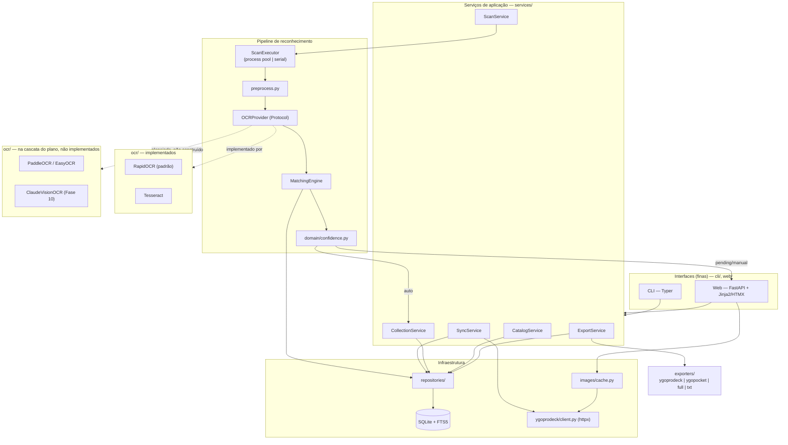

# Arquitetura

Documento vivo — atualizado conforme o código muda, ao contrário de
[`PLAN.md`](PLAN.md), que é o plano técnico original (histórico: continua
correto sobre *por que* as decisões foram tomadas, mas o diagrama e a
estrutura de módulos aqui refletem o estado atual do repositório). Decisões
individuais relevantes têm seu próprio ADR em [`adr/`](adr/).

## Visão geral

Monolito modular em Python: um núcleo de domínio (regras puras, sem I/O)
consumido por duas interfaces finas — CLI (Typer) e Web (FastAPI + Jinja2 +
HTMX) — que nunca duplicam lógica de negócio entre si, só formato de saída.
O catálogo do YGOPRODeck vive em SQLite local (com FTS5 para busca por nome);
a partir da sincronização inicial, a aplicação é 100% offline exceto por
syncs explícitos e download sob demanda de imagens.

## Diagrama

`web/scan_runner.py` não aparece no diagrama (é infraestrutura da
apresentação Web, não um serviço de aplicação): roda `ScanService.scan()` em
thread própria e traduz o callback de progresso em eventos SSE. Ver
[ADR 0008](adr/0008-progresso-de-scan-via-run-id.md).

## Camadas e responsabilidades

| Camada | Pode | Não pode |
|---|---|---|
| `domain/` | Regras puras: normalizar, parsear set code, calcular confiança | Importar SQLAlchemy, httpx, PIL |
| `db/` | Schema, engine, sessão, PRAGMAs | Conter regra de negócio |
| `repositories/` | Traduzir domínio ↔ SQL | Chamar serviços ou a rede |
| `ygoprodeck/` | Falar com a API externa | Escrever no banco diretamente (delega ao importer → repos) |
| `catalog_sources/` | Enriquecer o catálogo a partir de fontes de terceiros (`yaml_yugi/`) | Criar `Card` nova ou sobrescrever dado que já veio da YGOPRODeck (ADR 0012) |
| `images/` | Cache em disco e pré-processamento | Saber o que é uma carta |
| `ocr/` | Extrair texto de imagem | Saber o que é uma carta |
| `matching/` | Texto → carta/print | Escrever no banco |
| `scanner/` | Paralelismo e orquestração do pipeline | Conter regra de matching |
| `services/` | Casos de uso, transações, decisões | Conhecer HTTP ou terminal |
| `exporters/` | Serializar coleção por perfil | Consultar o banco (recebe dados prontos) |
| `cli/`, `web/` | Entrada e saída | Qualquer regra de negócio |

A regra de ouro do banco (plano §2.3): **um único escritor**. Workers de OCR
nunca tocam o banco — recebem um caminho de arquivo, devolvem um DTO puro
(`ScanOutcome`); matching e escrita acontecem no processo principal, em
lotes transacionais.

## Onde Hexagonal foi aplicado — e onde não

Interface/Protocol só onde há troca real de implementação (ver
[ADR 0006](adr/0006-hexagonal-seletivo.md)):

- **OCR** (`ocr/base.py::OCRProvider`) — 5 implementações previstas, 2
  construídas (RapidOCR, Tesseract; ver gap no §19.5 da PLAN.md).
  registradas por nome em `ocr/registry.py`.
- **Exportação** (`exporters/base.py::ExportProfile`) — 6 perfis
  registrados em `exporters/registry.py`, chave `(formato, nome)`.

O resto é código direto: repositórios são classes concretas com SQLAlchemy
dentro, sem interface abstrata, porque não há segundo backend de banco
planejado. *Interface sem segundo implementador é overengineering.*

## Dois fluxos, ponta a ponta

**Scan → coleção** (`ScanService.scan`, plano §5): `scanner/discovery.py`
encontra as fotos e filtra por hash já visto → `scanner/executor.py` distribui
entre workers (processo separado por padrão; RapidOCR carrega o modelo uma
vez por worker) → cada worker roda `images/preprocess.py` (ROI de nome e de
set code) → `ocr/*` lê o texto → de volta no processo principal,
`matching/engine.py` casa contra o catálogo (escada de tiers, §7.3) →
`domain/confidence.py` decide AUTO/PENDING/MANUAL/UNMATCHED → `AUTO` grava
direto em `collection_item` via `repositories/collection.py`; o resto vira
`scan_result` para a fila de revisão (`/review` ou `yugioh-scanner review`).

**Requisição Web → banco**: toda rota (HTML ou `/api/v1/*`) recebe os mesmos
serviços via injeção de dependência (`web/deps.py`) — uma sessão de banco por
requisição (`database.session()`, commit no sucesso/rollback em exceção),
serviços de aplicação compartilhados entre HTML e JSON. Erros de domínio
(`errors.py::YugiohScannerError`) viram status HTTP pelo handler global em
`web/app.py::_error_status` — nunca um traceback cru para o navegador.

## Decisões registradas

Ver [`adr/`](adr/) para o histórico completo. Resumo:

| ADR | Decisão |
|---|---|
| [0001](adr/0001-limiares-de-confianca.md) | Limiares de confiança: calibrados contra 270 fotos reais; bug de matching (colisão CJK) achado e corrigido |
| [0002](adr/0002-stack-tecnologica.md) | Stack: FastAPI + Jinja/HTMX + SQLAlchemy 2.0 + Typer + RapidOCR |
| [0003](adr/0003-rapidocr-como-padrao.md) | RapidOCR como OCR padrão em vez de Tesseract |
| [0004](adr/0004-claude-vision-fallback-opcional.md) | Claude Vision como fallback opcional, não OCR principal |
| [0005](adr/0005-cache-local-de-imagens.md) | Cache local de imagens obrigatório; nunca hotlink ao YGOPRODeck |
| [0006](adr/0006-hexagonal-seletivo.md) | Hexagonal aplicado só em OCR e exportadores |
| [0007](adr/0007-sem-autenticacao.md) | Sem autenticação nesta versão |
| [0008](adr/0008-progresso-de-scan-via-run-id.md) | Progresso de scan via `run_id` opaco, não `job_id` |
| [0012](adr/0012-enriquecimento-yaml-yugi-e-overrides-de-print.md) | Enriquecimento via `yaml-yugi` (Opção B) + overrides de print aprendidos do uso (Opção D) |
